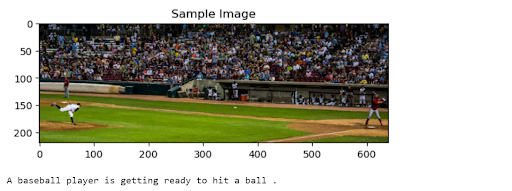
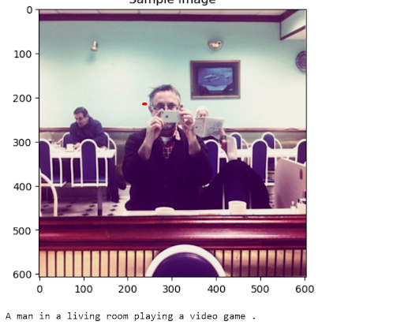
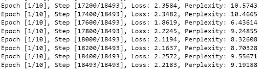
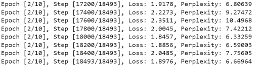

# Automatic Generation of Image Captions
Group: Anna Batra & Nicholas Boren

## Abstract

In this project we work on image to text with automatic generation of image captions, using a CNN-RNN neural network. Building off of pre-existing code, we continue to experiment and try to improve upon the model by updating and adding in new components to the pre-existing code.

These new components include adding on character level training. We then compare the two models, word-level and character-level, and compare them to each other.

## Video
Here is a video explaining our project (the same information stated below). We also have a live demo at the end with our finished model generating captions for a few images.

[Video Link Here](https://washington.zoom.us/rec/share/e2eYZfAGLVuVWazyBpWHZWUkP73iDXv27vaMXPfxxCbGT6x1wct_xToz6dxR-B4e.yc_ozvs5A0uXg447?startTime=1670886307000)

## Problem Statement

We are exploring whether a single-layer word-level LSTM model outperforms a character-level one.

Originally were also exploring whether a two-layer bi-LSTM with word + character level embeddings would perform better than a single-layer word model. We also hoped to make use of the validation set and use CIDEr as an evaluation metric.

## Starter Code, Datasets, and Related Work
We build off of the starter code provided by the [Udacity Computer Vision Nanodegree Program](https://github.com/sauravraghuvanshi/Udacity-Computer-Vision-Nanodegree-Program/tree/master/project_2_image_captioning_project). They use a CNN-RNN architecture model for automatically generating image captions. The network is originally trained on the Microsoft Common Objects in COntext (MS COCO) 2014 dataset. 

We trained, validated, and tested on the [Microsoft Common Objects in COntext (MS COCO)](https://cocodataset.org/#home) 2017 images dataset. MS COCO is one of the public datasets most commonly used for image captioning.

We also made use of the [Sama-Coco Dataset](https://www.sama.com/sama-coco-dataset/), a relabelling of the Coco-2017 dataset, for the annotations. The annotations are much more precise and comphrehensive than the original, and there are also notably more than one caption per image. This better reflects the variability in captions as language is productive. Our hope is that this will better improve the model in terms of training.

Our idea for this project and basic learning came from our very own Deep Learning class as well!

## Methodology

Originally, the pre-existing code used the MS COCO 2014 dataset for images and annotations. We improved upon it by using the newer 2017 images dataset and making use of the Sama-Coco Dataset for more precise and comphrehensive annotations.

In the pre-existing code, it makes use of a single layer LSTM, trained on the word-level. For this project, in addition to the Word Vocabulary code given, we created one for the Char Vocabulary. We also altered the DataLoader to take into account the new vocabulary. With our new vocabulary, we attempted to train a character-level model as well. We will then compare our word level and character level models using perplexity as our metric.

## Experiments/Evaluation

### Hyper-parameters

Here are the hyper-parameters we used for our models:
| Hyper-parameters  | Word-Level    | Character-Level  | 
| -----------       | -----------   | --               |
| Batch Size        | 32            | 10               |
| Vocab Threshold   | 6             | 6                |
| Embedding Size    | 512           | 512              |
| Hidden Size       | 512           | 512              |
| Number of Epochs  | 10            | 1                |

### Word-Level Model

For the word-level model, we let it run until the end of 3 epochs. The model took about 9 hours 08 minutes to run, and we noticed that it actually did it's best in the 2nd epoch so we stopped it from running more.

Here are the results for the word-level model at the end of each epoch. We can see that it does the best at the end of the second epoch with a loss of 1.8976 and a perplexity of 6.66964.

| Word-Level  | Epoch 1    | Epoch 2   | Epoch 3 | 
| ----------- | -----------| --        | -----   |
| Loss        | 2.2183     | 1.8976    | 2.0530  |
| Perplexity  | 9.19188    | 6.66964   | 7.79131 |
 

### Character-Level Model

For the character-level model, we let it run until the end of the first epoch. The model took about 5 hours 01 minutes to run. 

After running it we discovered that during inference time we were getting captions one character long for each picture. It was also the same character for each picture. Something is definetly wrong with our model here, and we can pinpoint that it's probably happening with our CharVocabulary or DataLoader __getitem__ method. We think there's a least in error where we try to pass getting a word to the __getitem__ and it unks everytime, unless it's a single character word, since it's not in the character dictionary. We need to look into more why we are getting an output with exactly one character per image.

Here are the results for the character-level model at the end of the first epoch. According to these results it does much better than the word-level, but it's also not producing the right captions.

| Character-Level  | Epoch 1     |
|------------------|-------------|
| Loss             | 0.3383      |
| Perplexity       | 1.0426      |

## Results

We are evaluating using the perplexity metric. With our character-level model not working, we cannot really compare it with our word-level. However, we can compare our word-level models under the different epochs at inference time.

We noticed that despite Epoch 2 having a better loss and perplexity, it actually seems to have better captions at the end of Epoch 1. We used our own human judgements to compare them.

### Epoch 1:

### Epoch 2:

We speculate that perplexity may not be the best evaluation metric for this kind of task possibly, or that something is also going wrong with our word-level model, especially after the first epoch.

## Future Steps
When we first started this project, there was a lot we envisioned for it but could not accomplish it due to the short timeframe and limited GPU.

### Full utilization of GPU
Run torch.utils.bottleneck to figure out why the GPU isn’t being fully utilized.

### Character-Level Model Improvement

The next steps we would like to look into is fixing our character-level model to actually produce sentence like captions. 

### Word-Level Model Results Exploration
We also would like to look into why Epoch 1 of our word-level model seems to be doing better than out Epoch 2, despite Epoch 2 having a lower loss and perplexity. Maybe this may mean looking into a better evaluation metric that we explain later in the next paragraph. Maybe implementing stratification of our training data split might also help this.

### Validation Set and CIDEr Evaluation Metric

 Something we envisioned doing as well is making use of our validation set. We started altering the DataLoader to take into an account of mode for validation, but did not make far progress due to limited time and re-figuring out goals for this project. Initially, we imagined that we could get through using the CIDEr evaluation metric. Using this along with the validation set, we thought it would be better than perplexity for making improvements in the model based off the hyperparameters. But having done quite a lot of research on this, we found out that adding this onto our plate will take quite a lot of time.

Here are the resources we look into about this:

The paper [CIDEr: Consensus-based Image Description Evaluation](https://arxiv.org/abs/1411.5726) that explains the evaluation.

This paper [ExpansionNet v2: Block Static Expansion in fast end to end training for Image Captioning](https://arxiv.org/abs/2208.06551v3 implements it in a way to speed up the process and provide better results that was done during the original CIDEr paper (right above this).

### Mixed Word and Character Level training with bi-LSTMs

The paper [Multilingual Part-of-Speech Tagging with Bidirectional Long Short-Term Memory Models and Auxiliary Loss](https://paperswithcode.com/paper/multilingual-part-of-speech-tagging-with) explores using bi-LSTMs for POS tagging. They use a two-layer bi-LSTM, where the first is character level and the second is both character level and word level. This paper found out that this model does better than just word level. This heavily influenced us in choosing to create a decoder like this, as it may possibly improve our model as well. Having run into the issue with the character-level model, we did have much time to realize this possibility.

### Interactive Website

Our other hope was to create a much better looking website that can also allow the user to submit their own pictures and retrieve captions from each of our three models.

## Github Repository
You can find our [Github repository here](https://github.com/NicholasBoren/Image-Captioning).
